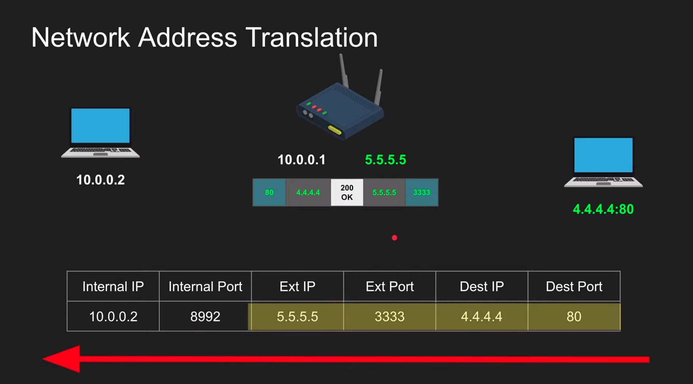
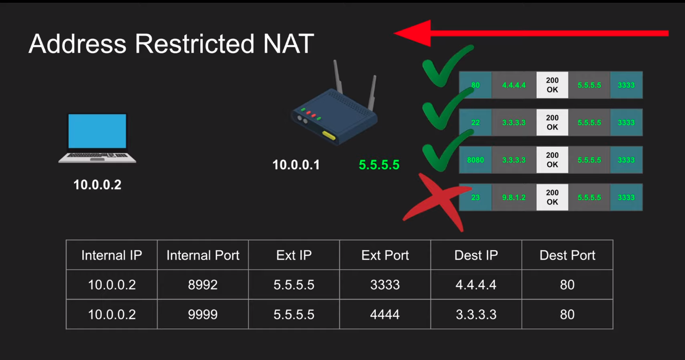

# Course--WebRTC-Crash-Course
Course tutorial referenced by [WebRTC Crash Course: 
Hussein Nasser](https://www.youtube.com/watch?v=FExZvpVvYxA)

WebRTC (Web Real-Time Communication) is a free, open-source project that provides web browsers and mobile applications with real-time communication (RTC) via simple application programming interfaces (APIs).

Goal: let's design a protocol that connects peer to peer that shortest possible lowest latency path and let's provide a nice api that a simple for every one to use.

## Why build **webRTC**?

We build it because we need to transmit media: (audio and video) in a standardized way in low latency way. standardized mean i need an API simple to use.

low latency: ?

## WebRTC main parts
 - NAT
 - STUN, TURN
 - ICE
 - SDP
 - Signaling the SDP

 ### Network Address Translation (NAT)
Devices that can be connected to the Internet have an IP address but in NAT we can use a private IP address in our private network. router configure to NAT i.e. router 10.0.0.2 private IP address to convert public IP address and store in NAT table with port. deep exprenation on: [geeksforgeeks](https://www.geeksforgeeks.org/network-address-translation-nat/)

## NAT Transmissions Method
1. One to One NAT (Full-cone NAT)

    Full-cone NAT check only external ip address and port available or not in the NAT Table.

    The router configure that  Full-cone NAT mean 
    

2. Address Restricted NAT

    Address Restricted NAT check only Destination IP

    