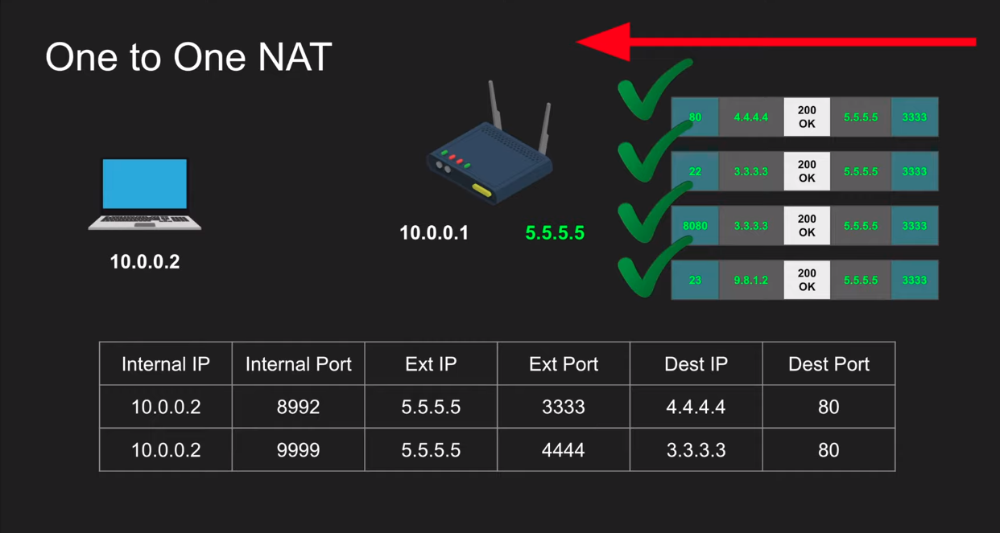

# Course--WebRTC-Crash-Course
Course tutorial referenced by [WebRTC Crash Course: 
Hussein Nasser](https://www.youtube.com/watch?v=FExZvpVvYxA)

WebRTC (Web Real-Time Communication) is a free, open-source project that provides web browsers and mobile applications with real-time communication (RTC) via simple application programming interfaces (APIs).

Goal: let's design a protocol that connects peer to peer that shortest possible lowest latency path and let's provide a nice api that a simple for every one to use.

## Why build **webRTC**?

We build it because we need to transmit media: (audio and video) in a standardized way in low latency way. standardized mean i need an API simple to use.

low latency: ?

## WebRTC main parts
 - NAT
 - STUN, TURN
 - ICE
 - SDP
 - Signaling the SDP

 ### Network Address Translation (NAT)
Devices that can be connected to the Internet have an IP address but in NAT we can use a private IP address in our private network. router configure to NAT i.e. router 10.0.0.2 private IP address to convert public IP address and store in NAT table with port. deep exprenation on: [geeksforgeeks](https://www.geeksforgeeks.org/network-address-translation-nat/)

## NAT Transmissions Method

1. One to One NAT (Full-cone NAT)

    Full-cone NAT check only external ip address and port available or not in the NAT Table.

    The router configure that  Full-cone NAT mean 
    

2. Address Restricted NAT

    Address Restricted NAT check only Destination IP

    

3. Port Restricted NAT

    

4. Symmetric NAT

    

## Session Traversal Utilities for NAT (STUN)

- We traverse the session. this is a bunch of utilities. one of the utilities is just get my public IP address and port through NAT and the layer of information put in the packet and then send it back to me as data.

- Work for Full-cone, Port/ Address restricted NAT.

- Doesn't work for symmetric NAT.

- these server port cheap to maintain because a docker container has a stun server and it's very lightweight. response back content. google give you public STUN server because they don't care they search so cheap to maintain.
    - STUN server port **3478**: server usually run on this port.
    - TLS server port **5349** : secure STUN

### STUN Request
Goal: We can find out our public presents so we can communicate public presents to someone and they communicate with us.

#### Explanation how work STUN

- We create a packet and i want to request my STUN server. first user create a package, that  destination is 9.9.9.9, port is 3478 and may ip and port is 10.0.0.2:8992.

    

- Sended to the router. Router just remapping the packet and store data in NAT table.

    

- That request send to the server and server check it this is a STUN request then take your public presence is 5.5.5.5:3333 pushing into a packet and send back to a server.

    

- Server check the NAT table.

    

- The router is change the information through the NAT Table.⬇⬇⬇⬇⬇⬇⬇⬇⬇⬇⬇

    

- And lost this information 5.5.5.5:3333. the packet is encrypted through the TLS and the packet information is send to the user.

    

#### STUN when it work

- Both devices have a separate router and request to the server through full-cone NAT. This is use full-cone NAT mean allow every one when then is at least established the communication with the server. 
I am communicate to the server with send a packet and your presents is save here. when i talk to any person check the my presents available or not in the destination user router. mean my presents stored that user router and that user presents stored in my router. They will have matching addresses so their addresses will matched then can send information before that i can't communicate.
That user connected each other shortest path with lowest latency.

    

#### STUN when it doesn't work

- When presents is not matched the not connected to each other.

    